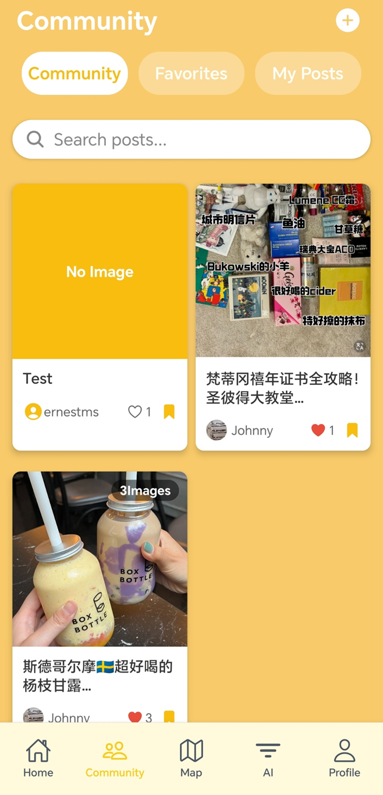
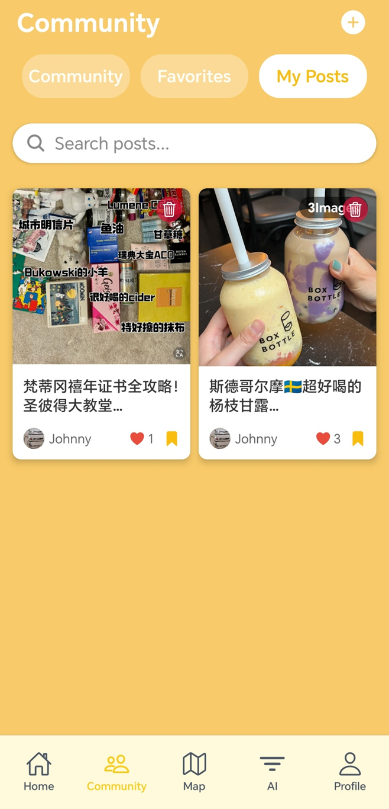
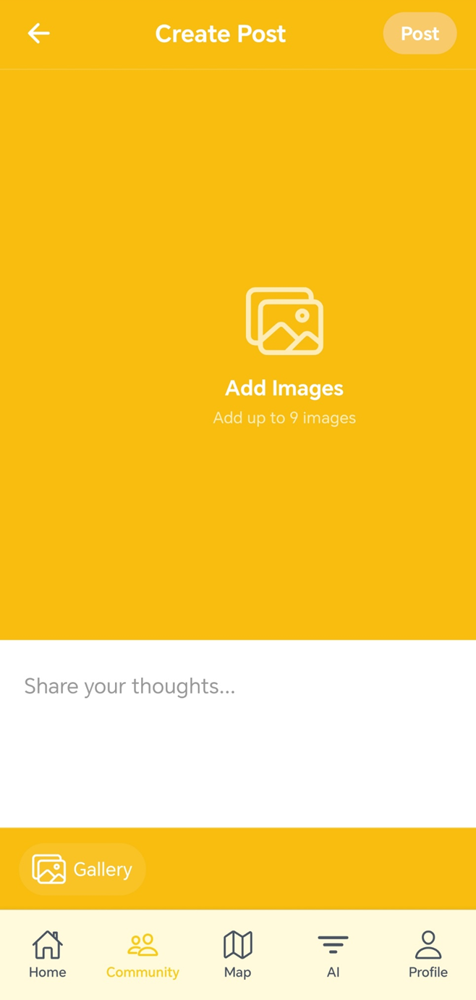
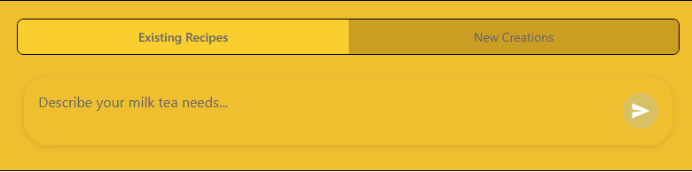
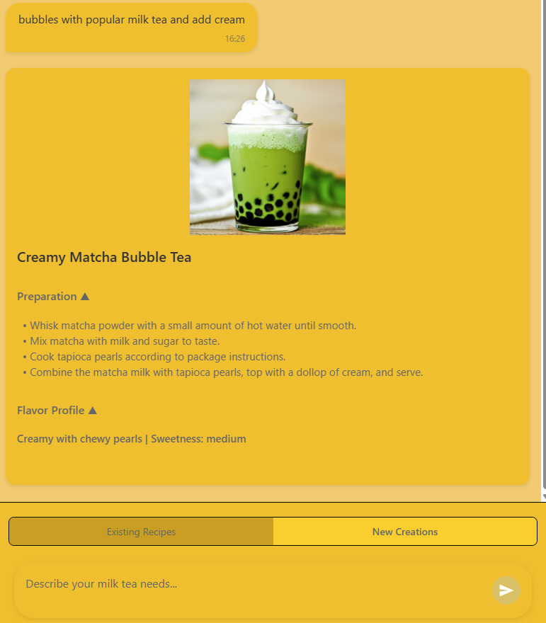

# Bubble Tea Enthusiast App - README

## 🧋 App Overview

The Bubble Tea Enthusiast app is your ultimate companion for discovering, exploring, and saving your favorite bubble tea recipes and flavors. With a beautiful yellow-themed UI and intuitive navigation, this app helps bubble tea lovers discover new flavors and keep track of their favorites.

## 📱 Main Features

### Onboarding Experience

- Smooth introduction to the app with fullscreen image slideshow
- Easy navigation with Next/Skip buttons
- One-time experience with option to reset

### Home Screen

- **Featured Recommendations** showcase popular bubble tea options
- **Personalized Recommendations** based on your preferences
- **Category Filtering** to quickly find Milk Tea, Fruit Tea, Coffee, etc.
- **Search Functionality** to find specific bubble teas by name or ingredients
- Beautiful ticket-style recommendation cards

### Tea Details View

- Rich visual display with high-quality images
- Comprehensive information: prep time, ingredients, steps
- Add to favorites functionality with one-tap saving
- Detailed preparation instructions and tips

### Tea List & Categories

- Browse all bubble teas in an organized grid or list
- Filter by categories: Milk Cap, Milk Tea, Coffee, Fruit Tea, and Herbal Tea
- Sort options (by name, prep time, etc.)
- Quick access to detailed information

### User Profile & Authentication

- User-friendly email login and registration
- Profile customization with nickname and avatar
- View and manage favorite bubble teas
- Reset onboarding experience option
- Secure authentication system

### Navigation & UI

- Slide-in sidebar menu for easy navigation
- Beautiful yellow-themed interface with clean typography
- Responsive design for various screen sizes
- Intuitive iconography for improved user experience

# How to Use Community Function

## 📱 Main Features

### Community Feed

- View community posts with images and captions.

- Search posts by keywords.

- Save posts to your **Favorites**.

- Switch between main page, favorite posts and My post page.

- Add new posts via the `+` button.

- Heart and bookmark functionality for post interaction.

  

### Favorites Page

- Search your favorites posts by keywords.

- Cancel your favorite posts collection via the `x` button or press the bookmark

- Heart and comment functionality for post interaction.

- Press the post to view the details

  

### My Posts Page

- View all your own community posts with images and captions.

- Manage your own post, delete the post you don't want to share.

  

### Create Post Page

- Try to create your own post and share them to the community.
- You can upload at most 9 images from your local file system.
- Video is also supported
- Use the Post button to post your content.

## 🛠️ Third-Party Components

- **React Native**
- **Firebase Firestore** (for data storage)
- **Firebase Storage** (for image uploads)
- **Expo** (for development and testing)
- **React Navigation** (for tab and stack navigation)

## 🔄 User Evaluation

### ✅ Strengths

- **Visually Rich UI**: Clean card-based layout with image emphasis makes the app highly engaging.
- **Clear Structure**: Tabs and icons provide intuitive navigation.
- **Stable Service**: Using Firebase ensures fast sync and scalable storage.
- **Post Interaction**: Likes and bookmarks allow meaningful user engagement.

### 📌 Suggestions for Improvement

| Area               | Suggestions                                                  | Solution                                                     | Status |
| ------------------ | ------------------------------------------------------------ | ------------------------------------------------------------ | ------ |
| **Image Loading**  | Show placeholders or loading spinners while images load.     | While loading, show user the default message                 | ✅      |
| **Error Handling** | Display user-friendly messages for failed uploads/searches.  | Use the Alert to display upload error message                | ✅      |
| **Search**         | Consider fuzzy search or tag-based filtering.                | Learned to implement the fuzzy search by fuse.js but not implemented yet | ❌      |
| **Pagination**     | Implement lazy loading for performance on large datasets.    | We don't have such a large users group now, so we just ignore the performance optimization at this stage | ❌      |
| **Localization**   | Need to add a multilingual interface to achieve global promotion of the product | We learned i18n but not embedded it yet                      | ❌      |

# How to Use Find Nearby Tea Shops

## 🗺️ Feature Overview

At the top, there are three components that allow users to switch between list view and map view to see nearby bubble tea shops. Below, a search bar enables users to find their desired location. Additionally, users can easily return to their current location by clicking the "Use my location" button.

### List View

In list view, buttons below allow users to view nearby bubble tea shops. The "View Map" button switches to map view, displaying the selected shop on the map. The "Directions" button opens Google Maps for navigation to the shop or launches the map app on mobile devices.

### Map View

In map view, users can see a list of tea shops alongside a map marked with their locations. Clicking on a shop in the list will recenter the map to that specific tea shop. Pressing the "Directions" button will also open Google Maps for navigation or the map app on mobile devices.

## 🛠️ Third-Party Components

The Find Nearby Tea Shops application utilizes Google Maps APIs, including the Places API, Maps JavaScript API, Geocoding API, and Maps Embed API.

The application leverages several key libraries and services:

- **Google Maps Platform**: For all mapping, location, and place search functionalities, including Places API, Maps JavaScript API, Embed API, Geocoding API and so on.
- **Firebase**: The backend server, including API endpoints, is deployed on Firebase using Cloud Functions.
- **Expo Location**: (`expo-location`) Used to access the device's GPS data for the "Use my location" feature and for location-aware searches.
- **Axios**: Used for making HTTP requests to the backend API.

In `MapModel.js`, the constant `API_BASE_URL` is defined as `https://api-clxkj4hfqa-uc.a.run.app/api/maps`, which is the endpoint for all backend API calls.

## 👥 User Evaluation

User feedback indicates that this module is useful for finding bubble tea shops while hanging out. Initially, some users found that the list view and map view lacked seamless interactivity.

Here's a summary of typical user feedback:

### Positive Feedback:

- *"The 'Use my location' button is super convenient! It immediately shows me what's around."*
- *"I love how quickly it finds shops. The list updates fast as I move or search new areas."*
- *"The map view with the list of shops is great. I can tap a shop on the list and the map automatically centers on it."*
- *"Directions integration is very helpful. One tap and I'm in Google Maps with the route ready."*

### Constructive Feedback & Implemented Improvements:

- Original Feedback: 

  "It is a bit clunky to switch between the list and map just to see where shops from the list are located on the map. It's hard to find specific shop I interested in."

  - **Enhancement**: To address this, the "View on Map" button was added to each item in the list view. Clicking this button now selects the shop and switches to the map view, centering on that shop. Additionally, the map view now includes a scrollable list of tea shops, and clicking a shop in this list also recenters the map.

These enhancements allow users to more easily visualize the location of specific tea shops and navigate between different options they wish to visit.

# How to Use AI Recommendation

## 🤖 Feature Overview

**AI recommendation page has 2 options. Choose existing recipe or let AI generate new recipe based on your special requirements.**

- Press gray button to send your requirements to AI Server.

  

- If you choose the existing recipe AI Server will return the already exist recipe with preparation steps and flavor of the drink.

  

- If you choose the New Creations, AI Server will return the new creations drinks with preparation steps and flavor of the drink, and will generate a picture that you can have a basic impression of the drink that AI recommend.

  

## 🔍 How It Works

**How the AI recommendation Works:**

- The AI Recommendation Page send user requests to the AI Sever that is deployed on the Firebase.
- When the AI Server receives the user request the AI Server will generate a AIChat request combining with prompts to OpenAI by using OpenAI's API key.
- The request will include 2 parts:
  - The Drink Description
  - The image positive and negative prompts used to generate Drink's image (New Creations).

## 💻 Technical Implementation

**Where to call the AI Server?** **In src\models\AiChatModel.js, the function async generateRecommendation(params) is used to post data to AI Server and receive the response data.**

## 👥 User Feedback

**AI Recommendation User Feedback**

- **User YiXi**: "Good recommendation, detailed steps and descriptions. Compared with asking GPT directly, it can give a specific recipe which meets my requirements."

- **User Yang**: "The ability of generating the picture of new creating recipe can give me a overall impression of the drink, which help me to determine if it will meet my needs."

- **User LiWei**: "I like how the AI considers my preferences like sweetness and ingredients. The generated recipe was creative and tasted great!"

  

- **User Chen**: "The image generation feature is impressive. It gives me a visual preview that helps me decide before trying the recipe."

- **User Anika**: "Very convenient! I no longer need to search online for drink ideas—just tell the AI what I want, and it delivers with clear instructions."

## 🔮 Future Improvements

**AI Recommendation API Future Improvements**

- Add the ingredients list to help user to know what to prepare clearly.
- Add recipe share function to allow user to share the generated recipe with others.