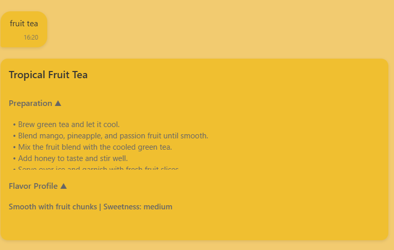
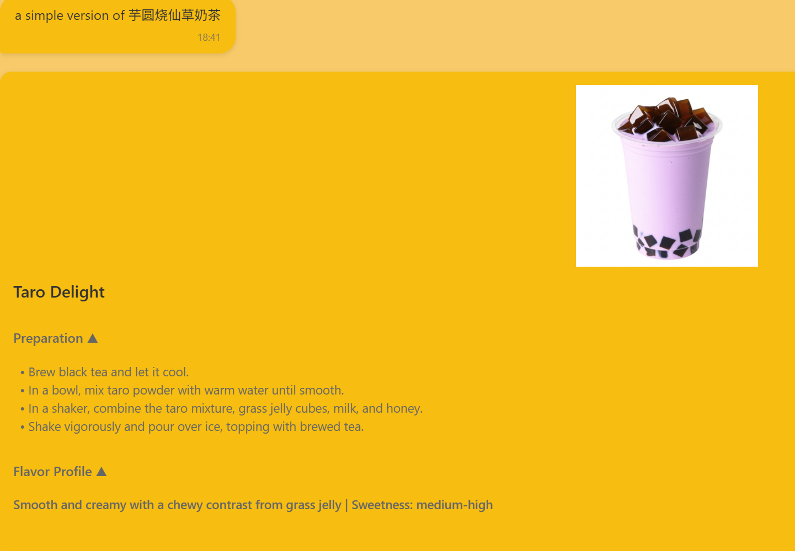

# How to Use AI recommandation
## AI recommandation page has 2 options. Choose existing recipe or let AI generate new recipe based on your special requirements.

Press gray button to send your requirements to AI Server.

If you choose the excisting recipe AI Server will return the already exist recipe with preparation steps and flavor of the drink.

If you choose the New Creations, AI Server will return the new creations drinks with preparation steps and flavor of the drink, and will generater a picture that you can have a basic impression of the drink that AI recommand.

## How the AI recommandation Works: The AI Recommandation Page send user requests to the AI Sever that is deployed on the Firebase. When the AI Server receives the user request the AI Server will generate a AIChat request combining with prompts to OpenAI by using OpenAI's API key. The request will include 2 parts the Drink Description and the image positive and negative prompts used to generate Drink's image (New Creations).

# Where to call the AI Server?
### In src\models\AiChatModel.js, the function async generateRecommendation(params) is used to post data to AI Server and receive the response data.

# AI Recommandation User Feed Back

User YiXi: Good recomandation, detailed steps and discriptions. Compared with asking GPT directily, it can give a specific recipe which meets my requirements.

User Yang: The ability of generating the picture of new creating recipe can give me a overall impression of the drink, which help me to determine if it will meet my needs.

User LiWei: I like how the AI considers my preferences like sweetness and ingredients. The generated recipe was creative and tasted great!

User Chen: The image generation feature is impressive. It gives me a visual preview that helps me decide before trying the recipe.

User Anika: Very convenient! I no longer need to search online for drink ideas—just tell the AI what I want, and it delivers with clear instructions.

# AI Recommandation API Future Improvements
Add the ingredints list to help user to know what to prepare clearly. Add recipe sure function to allow user to share the generated recipe with others.

