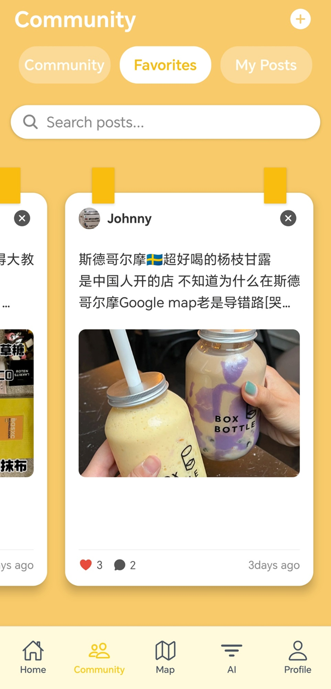

# How to Use Community function

## 📱 Features

- View community posts with images and captions.
- Search posts by keywords.
- Save posts to your **Favorites**.
- Switch between main page, favorite posts and My post page.
- Add new posts via the `+` button.
- Heart and bookmark functionality for post interaction.

## 📱 Features

- Search your favorites posts by keywords.
- Cancel your favorite posts collection via the `x` button or press the bookmark
- Heart and comment functionality for post interaction.
- Press the post to view the details

## 📱 Features

- View all your own community posts with images and captions.
- Manage your own post, delete the post you don't want to share.

## 📱 Features

- Try to create your own post and share them to the community.
- You can upload at most 9 images from your local file system.
- Video is also supported
- Use the Post button to post your content.

# Third-Party Components

- **React Native**
- **Firebase Firestore** (for data storage)
- **Firebase Storage** (for image uploads)
- **Expo** (for development and testing)
- **React Navigation** (for tab and stack navigation)

# User Evaluation

✅ Strengths

- Visually Rich UI: Clean card-based layout with image emphasis makes the app highly engaging.

- Clear Structure: Tabs and icons provide intuitive navigation.

- Stable Service: Using Firebase ensures fast sync and scalable storage.

- Post Interaction: Likes and bookmarks allow meaningful user engagement.

📌 Suggestions for Improvement

| Area               | Suggestions                                                                     | Solution                                                                                                    |
| ------------------ | ------------------------------------------------------------------------------- | ----------------------------------------------------------------------------------------------------------- |
| **Image Loading**  | Show placeholders or loading spinners while images load.                        | While loading, show user the defalt message ✅                                                              |
| **Error Handling** | Display user-friendly messages for failed uploads/searches.                     | Use the Alert to display upload error message ✅                                                            |
| **Search**         | Consider fuzzy search or tag-based filtering.                                   | Learned to implement the fuzzy search by fuse.js but not implemented yet ❌                                 |
| **Pagination**     | Implement lazy loading for performance on large datasets.                       | We don't have such a large users group now, so we just ignore the performance optimization at this stage ❌ |
| **Localization**   | Need to add a multilingual interface to achieve global promotion of the product | We learned i18n but not embedded it yet ❌                                                                  |
