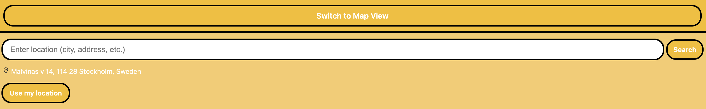
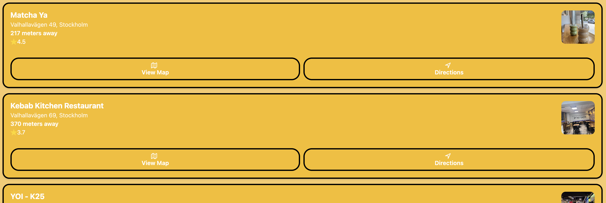
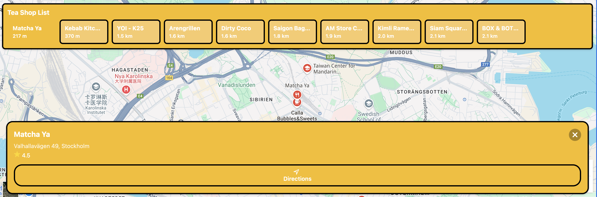

# How to Use Find Nearby Tea Shops

At the top, there are three components that allow users to switch between list view and map view to see nearby bubble tea shops. Below, a search bar enables users to find their desired location. Additionally, users can easily return to their current location by clicking the "Use my location" button.

In list view, buttons below allow users to view nearby bubble tea shops. The "View Map" button switches to map view, displaying the selected shop on the map. The "Directions" button opens Google Maps for navigation to the shop or launches the map app on mobile devices.

In map view, users can see a list of tea shops alongside a map marked with their locations. Clicking on a shop in the list will recenter the map to that specific tea shop. Pressing the "Directions" button will also open Google Maps for navigation or the map app on mobile devices.

---

# Third-Party Components

The Find Nearby Tea Shops application utilizes Google Maps APIs, including the Places API, Maps JavaScript API, Geocoding API, and Maps Embed API.

The application leverages several key libraries and services:

* **Google Maps Platform**: For all mapping, location, and place search functionalities, including Places API, Maps JavaScript API, Embed API, Geocoding API and so on.
* **Firebase**: The backend server, including API endpoints, is deployed on Firebase using Cloud Functions.
* **Expo Location**: (`expo-location`) Used to access the device's GPS data for the "Use my location" feature and for location-aware searches.
* **Axios**: Used for making HTTP requests to the backend API.
* In `MapModel.js`, the constant `API_BASE_URL` is defined as `https://api-clxkj4hfqa-uc.a.run.app/api/maps`, which is the endpoint for all backend API calls.

---

# User Evaluation

User feedback indicates that this module is useful for finding bubble tea shops while hanging out. Initially, some users found that the list view and map view lacked seamless interactivity.

Here's a summary of typical user feedback:

**Positive Feedback:**

* *"The 'Use my location' button is super convenient! It immediately shows me what's around."*
* *"I love how quickly it finds shops. The list updates fast as I move or search new areas."*
* *"The map view with the list of shops is great. I can tap a shop on the list and the map automatically centers on it."*
* *"Directions integration is very helpful. One tap and I'm in Google Maps with the route ready."*

**Constructive Feedback & Implemented Improvements:**

* **Original Feedback**: *"It is a bit clunky to switch between the list and map just to see where shops from the list are located on the map. It's hard to find specific shop I interested in."*

  * **Enhancement**: To address this, the "View on Map" button was added to each item in the list view. Clicking this button now selects the shop and switches to the map view, centering on that shop. Additionally, the map view now includes a scrollable list of tea shops, and clicking a shop in this list also recenters the map.

These enhancements allow users to more easily visualize the location of specific tea shops and navigate between different options they wish to visit.
